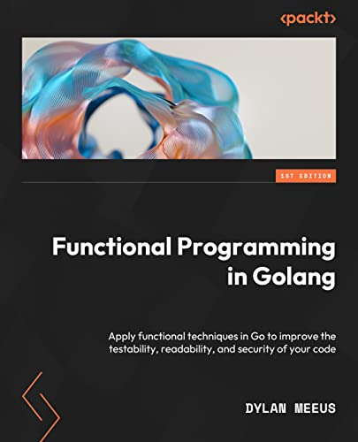
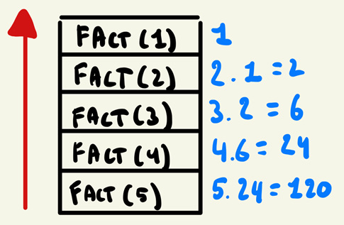

# **Summary of the book [Functional Programming in Go](https://www.oreilly.com/library/view/functional-programming-in/9781801811163/)**



<i>
<h3 style= "color: white; font-family: 'Times New Roman', serif;">
I have read this book and i highly recommend this book to anyone in software engineering industry and I personally think that developers should learn FP before OOP, this Summary is meant for people who want a refresher or people who already know FP and want to see it applied on Go.
</h3>
<h3 style= "color: white; font-family: 'Times New Roman', serif;">
If this is your first time with FP, please read this awesome 10/10 book from  <a href="https://www.oreilly.com/library/view/functional-programming-in/9781801811163/">O'reilly</a>
</h3>
</i>

> I have wrote this summary In a way to cover everything as much as possible, If anything is skipped I have actually wrote that "I have skipped X topic for reason Y"

> If you like this summary and interested in anything further I post you can follow my on [Linkedin](www.linkedin.com/in/kareem-anees-0496b62b3) or [Facebook](https://www.facebook.com/TheyCallMeAbdo)

---

<br>

## content table

---

<br>

# **PART 1: _ESSENTIALS_**

Basic stuff that requires some attention

## [Chapter 2]() _Functions as first class citizens_

## this chapter says how to treat functions as first class objects in go

---

### Type aliases

```go
// type aliases for primitive

type StringAlias string

func (s StringAlias) PrintS() {
	println(s)
}
```

<br>

- Now the `PrintS()` can operate on th s string, like in Javascript `string.topUppercase()` for example

```go
//usage

var s chapter2.StringAlias = "Hello, World!"
s.PrintS()
```

```go
// type aliases for functios

type Printer func(StringAlias)

func (p Printer) Print(s StringAlias){ // we also used the StringAlias
	p(s)// implamenting the functions
    // we can return the function again and do further chaining
}
```

```go
// usage
var p chapter2.Printer = func(s chapter2.StringAlias) {
		fmt.Println(s)
	}

p.Print("Hello, World!")
```

- we can also operate on _functions_

- **imagine anything else can be attached to types or structs**

---

### using functions as objects

- the core of first citizen

```go
// using functions as objects

type Adder func(int, int) int

func (a Adder) Add(x, y int) int {
	return a(x, y)
}

```

```go
// usage

var a chapter2.Adder = func(x, y int) int {
	return x + y
}

fmt.Println(a.Add(1, 2))
```

---

### everything else in this chapter is very basic programming and doesn't really worth mentioning

---

## [Chapter 3]() _Higher-Order Functions_

## **it is a function that either takes a function as input or return a function**

### partial application

as its name suggests, we execute the command on multiple stages, check code bellow

```go
// partial application

func Add(a, b, c int)  func(int) int {

    const r1 = a + b + c // first stage of exxecutions, it is successful and accually creates an output that satesifies the stage, but yet it is not usable

	return  func(d int) int {
		return r1 + d // this is the usable part
	}

}
```

```go
// usage of partial application

	add := chapter3.Add(1, 2, 3) // r1 = 6, we will be using this value now
	continueAdding := add(4)     // 10, it add 4 to the previous 6
	continueAdding2 := add(5)    // 11, it add 5 to the previous 6
	continueAdding3 := add(6)    // 12, it add 6 to the previous 6

	// print the results
	println(continueAdding)  // 10
	println(continueAdding2) // 11
	println(continueAdding3) // 12

```

---

### function currying

the idea of `function currying` is to chain the function but in higher order manner instead of passing a OOP-style struct (we will see that later on)

```go
func Combine(a, b, c int) int {
	return a + b + c
} // just normal function that adds 3 integers
```

below is the exact same function but using function currying

```go
func CombineWithCurrying(a int) func(int) func(int) int {
	return func(b int) func(int) int {
		return func(c int) int {
			return a + b + c
		}
	}
}
```

if you understand clousures then this thing is not black magic, look at the usage

```go
	// usage of currying
	combine := chapter3.CombineWithCurrying(1)(2)(3)  // 6
	combine2 := chapter3.CombineWithCurrying(1)(2)(4) // 7

	// print the results
	println(combine)  // 6
	println(combine2) // 7

```

## **if you think about it, it is the same idea as _partial implementation_ but in a nested manner**

### i have skipped closures beacuese it doesn't really make any sense to explain it in functional programming summary

---

## [Chapter 4]() _purity and testability_

<h3 style= "color: red;" >Important!</h3>

i know that you are going to skip this part but it worth mentioning two things; first: their are some useful topics here, second: escape analysis

> pure functions are essensial in go in terms of performance and **bottlenecks**, if you want to learn more about it visit my post about how purity can highrocket yor golang code performance [here](https://www.facebook.com/share/p/188hthkfx9/), also see this blog about how crazy can GC slow down your app [here](https://medium.com/@roopa.kushtagi/netflixs-journey-from-g1gc-to-zgc-tackling-tail-latencies-66ee75681d49)

---

### what is purity

_purity is not making any side effect_, also purity is coupled with immutability

- **mutable**: a mutable DS can be modified after it has constructed
- **immutable**: cannot be modified, it can only be deleted and recreated
- **Pure function**: a function that doesn't change any state in the program lifetime

> **_the keyword `const` in go creates an immutable DS and it cannot be altered after it's construction, Also the GC doesn't check any `const` declared DS in the heap_**

---

### Refrential transparency

it is when we can replace the function with it's output

**in other words, if we use the same function with the same inputs multiple times, each time it gives the same output (_statelessly_ without side effects or states)**

an example

```go
func a(x,y int) {
	return x + y
} // Refrentially treansparent as it always return the same x + y for the same x + y

func b() {
	return time.now()
} // every moment it returns a unique output (not Refrentially treansparent)
```

> **Idempotency**: it is the same concept as _Refrential transparency_; a function returns the same outputs with the same inputs everytime it is called

---

### the rest of this chapter talks about the benifets and use cases of pure and impure functions which is very clear actually and is not worth mentioning

---

<br>

## [Chapter 5]() _immutability_

## <p style="color:red;">The first part of this chapter talks about GC, Escape analysis, Stack and Heap. these are more of a prerequisite for Software engineering in general rather than being an FP concept</p>

### functor

a functor is a way to apply function `a` on DS `x`

```go
// functors

func functotAX[a, b any](strategy func(a) b, x []a) []b {
	var result []b
	for _, v := range x {
		result = append(result, strategy(v))
	}
	return result
}
```

```go
//usage

func strategy(a int) int { return a * 2 }

var x = []int{1, 2, 3, 4, 5}
var y = functotAX(strategy, x) // [2, 4, 6, 8, 10]

```

- the function `strategy` doesnt know anything except that it takes `a` and returns `a * 2`

- `functorAX` takes a set of elements (doesn't have to be of type `a`) and loop over them and call `strategy` on each of them

**another simpler example:**

```go
func functor2(strategy func(any) any, x any) any {
	return strategy(x) // clear huh?
}
```

---

### monads

<p style ="color:magenta">
 If you didn't understand the upcomming explaination; watch this 
 <a href="https://www.youtube.com/watch?v=HIBTu-y-Jwk&t=404s">Video</a>,
  monads are quite tricky to wrap your head around
</p>

- I like to think of **Monads** as _partial application_ but with two more concepts

  1.  `Maybe`: maybe the DS that we want is empety, so we wrap it in `Maybe` DS, that has a value

  2.  `Unit()`: Just a function that return the `Maybe` instead of direct interaction with it

  3.  `Bind()`: So we want to chain operations on this monad?, meet `Bind`, `Bind` is just a function that takes a function as input then it applies this function on the monad then returns `Mayby` so we can do further chaining if we want

look at this code

```go
// create Mayby to wrap an integer value
type Maybe struct {
    value *int
}

// Unit wraps a value in a Maybe box.
func Unit(val int) Maybe {
    return Maybe{value: &val}
}

// Bind function that operates on Maybe
func (m Maybe) Bind(f func(int) Maybe) Maybe {

	// this part is confusing, it just checks if there is a value, if no value then it do anything the return a Maybe
	// think of it as (empety case) and (value case) where each case has an operation, In our example it just returns an empty Maybe
	if m.value == nil {
        return Maybe{value: nil}
    }

    return f(*m.value) // Apply the function
}

// Example function to double a number
func double(n int) Maybe {
    return n * 2
}

func main() {
    // Start with a number in a Maybe box
    result := Unit(5). // returns a Maybe with value 5
        Bind(double). // Double it -> 10
        Bind(double). // Double it again -> 20
        Bind(double)  // Double it again -> 40
}

```

---

<br>

<br>

# **PART 2 _USING FP TECHNIQUES_**

It is becoming more exiting 🔥

> If you have reached this point I want to really thank you for your attention and time, I have spent almost 3 hours for **Part 1**

---

## [Chapter 6]() _Common categories of functions_

### Predicate based functions

it is a function that either returns true or false

```go
type Predicate[T any] func(T) bool
```

```go
// a predicate
func isGreaterThan0(val int) bool {
 return true or return false
}

// Common use case
func functor(val int, compare Predicate[int]) {
	// do work
	return compare(val)
}
```

---

### TakeWhile & DropWhile **VS** Filter

let us say that we want to check if a list has a value that is Devisable by 2 using predicates, an example predicate would be

```go
func isDevisableBy2(i int) bool {
	return i%2 == 0
}
```

<br>

`takeWhile()` loops over elements, apply some condition, once the condition fails it returns returns previous elements

```go

//expressive code from the book:
func TakeWhile[A any](input []A, pred Predicate[A]) []A {
	out := []A{}
	for _, element := range input {
		if !pred(element) {
			out = append(out, element)
		} else {
			return out
		}
	}
	return out
}

//usage
ints := []int{1, 1, 2, 3, 5, 8, 13}
result := TakeWhile(ints, isDevisableBy2) // [1,1], condition is met at 2

```

<br>

`dropWhile()` on the other hand oops over elements, apply some condition, once the condition fails it retuns the upcomming elements

```go
//expressive code from the book:
func DropWhile[A any](input []A, pred Predicate[A]) []A {
	out := []A{}
	drop := true
	for _, element := range input {
		if pred(element) {
			drop = false
		}
		if !drop {
			out = append(out, element)
		}
	}
	return out
}

//usage
ints := []int{1, 1, 2, 3, 5, 8, 13}
result := DropWhile(ints,isDevisableBy2) // [2 3 5 8 13] condition is met at 2
```

<br>

`Filter` I will get to _filters_ later in this doc but for now a filter will non-stop apply a condition on each element in the list and will return a list of the successful ones

> ## **Common Uses of `dropwhile` and `takewhile`**
>
> 1.  **Processing a Stream of Data**
>
> - **Example**: In a log file, you might want to:
>   - **`dropwhile`**: Skip lines until you find the first error message.
>   - **`takewhile`**: Read all lines of error messages until the next non-error line.
> - **Why?** These functions are great for handling sequential data without loading it all into memory.
>
> ---
>
> 2.  **Finding a Subsection of a List**
>
> - **Example**: Suppose you’re analyzing stock prices and want:
>
>   - **`takewhile`**: Collect prices as long as they are increasing.
>   - **`dropwhile`**: Skip prices until the first significant dip.
>
> - **Why?** They can extract specific segments of data dynamically.
>
> ---
>
> 3.  **Parsing Input Until a Condition is Met**
>
> - **Example**: Reading user input from a file until encountering a specific delimiter.
>   - **`takewhile`**: Take input until encountering a stop word like "END."
>   - **`dropwhile`**: Skip a header section until reaching the main content.
> - **Why?** Efficient for processing structured or semi-structured text.
>
> ---
>
> 4.  **Filtering Events in Time Series Data**
>
> - **Example**: Given a time series of sensor data:
>   - **`dropwhile`**: Ignore measurements below a threshold until the system warms up.
>   - **`takewhile`**: Process data only as long as it stays above a threshold (e.g., valid operating range).
> - **Why?** Helps manage ranges of interest in data.
>
> ---
>
> 5.  **Handling Sorted Data**
>
> - **Example**: A sorted list of numbers where you:
>   - **`dropwhile`**: Skip all numbers below a threshold.
>   - **`takewhile`**: Take all numbers below another threshold.
> - **Why?** Works seamlessly with sorted sequences where conditions are monotonic.
>
> ---
>
> 6.  **Batch Processing in Pipelines**
>
> - **Example**: If you're processing a stream of tasks in batches:
>   - **`takewhile`**: Group tasks of a specific priority until a lower-priority task appears.
>   - **`dropwhile`**: Skip all low-priority tasks.
> - **Why?** Makes it easy to handle varying priorities or task states.
>
> ---
>
> 7.  **Cleaning Data**
>
> - **Example**: In a dataset:
>   - **`dropwhile`**: Remove leading zeros or missing values.
>   - **`takewhile`**: Extract clean data until the first anomaly.
> - **Why?** Automates cleaning operations without explicit loops.
>
> ---

---

### Transormers/Maps

`maps` not `hashMaps`

A higher oreder function that takes a reference to a DS and apply changes to it

```go
type MapFunc[A any] func(A) A

func Map[A any](input []A, m MapFunc[A]) []A {
	output := make([]A, len(input))
	for i, element := range input {
		output[i] = m(element)
	}
	return output
}
```

> the previos `Map()` is a _pure Map_ which doesn't change the elements in the original slice, this is not usually the case, mostly a map operates on the DS rather than copying it

---

### Reducers

this is very confusing for me personaly, I don't know why, It is even more confusing than _monads_

```go
// this is the application function type
type ReduceFunc[T any] func(p1, p2 T) T
```

```go
func Reduce[A any](input []A, reducer reduceFunc[A]) A {

	result := input[0] // the first element

	for _, element := range input[1:] { // starting from the second element
		result = reducer(result, element) // the first and second, then the second and third, etc...
	}

	return result // finally returns the reduced one
}
```

```go
// usage
func sum(a1, a2 A) A { return a1 + a2 }

total := Reduce({1,2,3,4,5}, sum) // 1 + 2 + 3 + 4 + 5 = 15
```

> _Reducers_ are very good soloution in improving time complexity

---

## [Chapter 7]() _Recursion_

_recursion_ is very tricky to design specially if you are designing _Tree factory_

a _recursion_ is a function that calles itself

```go

func recursive() {

	if condition { // This part is called Base case
		return
	}

	recursive() // this is called recursive case
}

```

<br>

the following code is an example on recursion

```go
// example
func Fact(input int) int {
    if input == 0 {
        return 1
    }
    return input * Fact(input-1)
}
```

```go
// usage
Fact(5) // 120
```

<br>

you can think or what happened as follows

```go
Fact(5) = 5 * Fact(4) = 5 * 24 = 120
Fact(4) = 4 * Fact(3) = 4 * 6 = 24
Fact(3) = 3 * Fact(2) = 3 * 2 = 6
Fact(2) = 2 * Fact(1) = 2 * 1 = 2
Fact(1) = 1 * Fact(0) = 1 * 1 = 1
Fact(0) = 1
```

or as follows



---

<br>

> I personally dont recommend using _recursion_ in a production code-base as it adds up complexity and error prone and hard to debug and causes **_Stackoverflows_**, unless their is an urgent need for a recursive solution and loops are not able to solve the problem

> _Recursion_ is prefered in functional programming, but being striktly loyal to a principle of paradigm over readability or performance is suicidal

---

### the rest of this chapter compares _Recursion_ with _Loops_

---

## [Chapter 8]() _Composition of functions_

this chaprter is about chaining and continuos executing of functions, like what we did in _currying_ & _partial application_ & _monads_ but in much simples and OOP frindly manner

---

### Dot notation chaining

in **_Go_** we can't add methods to DS but we can do this to types, we can either attach _functions_ to a type

```go
package main

type Str struct {
	value int
}

func (S *Str) add(x int) *Str {
	S.value += x
	return S
}

func (S *Str) subtract(x int) *Str {
	S.value -= x
	return S
}

func main() {
	s := &Str{value: 10}
	s.add(5).subtract(3)
	println(s.value) // 12, 10 + 5 - 3

}

```

in the code above we used `Str` struct in OOP manner and returned it as output of ts's methods

> **_Go_** doesn't support for _Lazy evaluation_, **_Go_** does _strikt evaluations_ which means that a statement is called once the runtime reach it, see this awesome paper about this topic [Lazy Evaluation for the Lazy: Automatically Transforming Call-by-value Into Call-by-need](https://lac-dcc.github.io/pubs/TechReports/LaC_TechReport012022.pdf)
>
> with being said the interface of a function is it's output, If you have function `x` that returns output `a`, then all users will see it as `a` as it generates `a` once a _"()"_ is put on it
>
> in _lazy evaluation_ `x` will generate `a` only when another user use it, which is not our case

<br>

another way to do it is to define your data-type in a more direct way and more "functionally frindly" manner

```go
// defined a type for int instead of an entire struct
type number int

func (n number) add(x number) number {
	return n + x
}

func (n number) sub(x number) number {
	return n - x
}

func main() {

	var n number = 5
	n = n.add(3)
	n = n.sub(2)
	println(n) // 6

}
```

---

### CPS

**short for:** _Continueos-passing style_

> Note from the book:
>
> A continuation is a somewhat abstract concept in the realm of programming languages. It is a function that represents the next computation of a program. It essentially captures the state of our program at the moment of execution (more specifically, the stack), and provides the next step of execution as a function that can be called.

A CPS is commonly refered in _Event Driven Architecture_ as _call-back pattern_, the main function do some staff in asynchronous manner then calls your code

```go
import "sync"

var wg = sync.WaitGroup{}

func APICall(url string, cb func(string)) {
	wg.Add(1)

	data := "Data from API call: " + url

	go func() {
		defer wg.Done()
		cb(data)
	}()
}

func main() {

	APICall("http://example.com", func(data string) {
		println(data + "API call 1")
	})

	APICall("http://example.com", func(data string) {
		println(data + " API call 2")
	})

	wg.Wait() // Wait for all API calls to finish, before exiting the program, thus they will finish in random order

}
```

the code above executes `cb` with the provided `data`, this pattern is commonly used in _JavaScript_ $ _Node.JS_ and is very usefull in handling IO and doing basic code execution in _non-blocking_ manner
